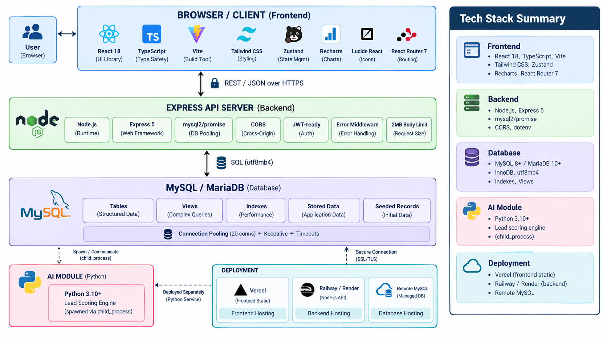
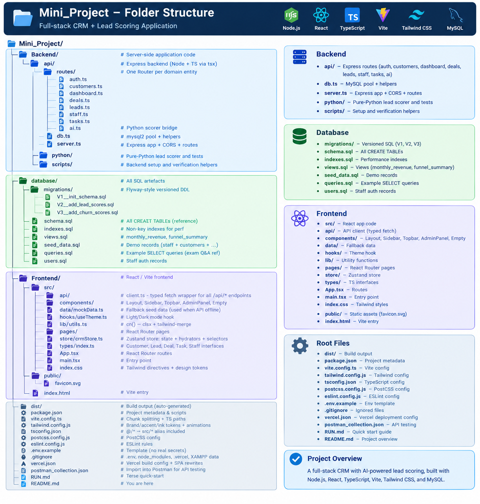

# Smart CRM — Full-Stack DBMS Mini Project

> **DBMS Mini Project | Third Year** | React + TypeScript + Express + MySQL + Tailwind CSS

---

## Table of Contents

1. [Project Overview](#1-project-overview)
2. [Tech Stack &amp; Architecture](#2-tech-stack--architecture)
3. [Database Design (ER Schema)](#3-database-design-er-schema)
4. [10-Minute Demo Script (Timed)](#4-10-minute-demo-script-timed)
5. [Key Features Deep-Dive](#5-key-features-deep-dive)
6. [API Endpoints Reference](#6-api-endpoints-reference)
7. [Scalability &amp; Best Practices](#7-scalability--best-practices)
8. [Vercel Deployment Guide](#8-vercel-deployment-guide)
9. [Local Development Setup](#9-local-development-setup)
10. [Folder Structure](#10-folder-structure)
11. [Login Credentials](#11-login-credentials)

---

## 1. Project Overview

**Smart CRM** is a production-ready Customer Relationship Management system built for sales teams. It tracks the entire customer lifecycle:

- 👥 **Customers** with churn risk scoring
- 🎯 **Leads** with drag-and-drop pipeline Kanban
- 💼 **Deals** with win probability & forecasting
- ✅ **Tasks** with priorities, due dates, and assignees
- 📊 **Dashboard** with KPIs, revenue trend, and lead funnel
- 🤖 **AI Lead Intelligence** (Python-based lead scorer)
- 👤 **Staff Authentication** with role-based workspace

The system falls back gracefully to embedded mock data when the MySQL backend is not reachable, making it fully functional in static demo environments (Vercel preview).

---


## 3. Database Design (ER Schema)

### Core Tables

| Table                         | Purpose                              | Key Fields                                                                             |
| ----------------------------- | ------------------------------------ | -------------------------------------------------------------------------------------- |
| **`staff`**           | Sales team / users                   | `id`, `name`, `email`, `password_hash`, `role`                               |
| **`customers`**       | Company contacts (accounts)          | `id`, `name`, `company`, `email`, `industry`, `churn_score`                |
| **`leads`**           | Sales pipeline opportunities         | `id`, `customer_id`, `stage` (enum), `value`, `lead_score`, `assigned_to`  |
| **`deals`**           | Negotiated contracts                 | `id`, `customer_id`, `stage`, `value`, `win_probability`, `expected_close` |
| **`tasks`**           | Follow-ups & reminders               | `id`, `title`, `status` (enum), `priority`, `due_date`, `assignee`         |
| **`interactions`**    | Call/email/note history per customer | `id`, `type` (enum), `customer_id`, `user_id`, `timestamp`                   |
| **`lead_scores`**     | AI scoring cache (per-lead)          | `id`, `lead_id` (FK→UNIQUE), `score`, `features_json`                         |
| **`churn_scores`**    | Customer churn scoring history       | `id`, `customer_id` (FK→UNIQUE), `score`, `features_json`                     |
| **`monthly_revenue`** | Materialized revenue summary view    | `month`, `won_value`, `pipeline_value`, `deal_count`                           |
| **`funnel_summary`**  | Stage conversion counts              | `stage`, `lead_count`, `total_value`, `pct_of_leads`                           |

### Key Indexes

```sql
-- Optimized for the most frequent WHERE / JOIN patterns
CREATE INDEX idx_leads_stage       ON leads(stage);
CREATE INDEX idx_leads_assigned    ON leads(assigned_to);
CREATE INDEX idx_customers_churn   ON customers(churn_score);
CREATE INDEX idx_customers_industry ON customers(industry);
CREATE INDEX idx_tasks_status_priority ON tasks(status, priority, due_date);
CREATE INDEX idx_deals_stage_value ON deals(stage, value DESC);
CREATE INDEX idx_interactions_customer ON interactions(customer_id, timestamp DESC);
```

### Views

- `customer_health` — joins customers with aggregated lead counts, deal totals, recent interaction freshness
- `rep_performance` — per-staff KPIs: leads assigned, deals won, tasks completed, revenue

### Integrity Constraints

- **FK cascades** — deleting a customer removes all their leads/deals/interactions
- **`SET NULL`** — removing a staff member un-assigns their records (not data loss)
- **CHECK** — `win_probability BETWEEN 0 AND 100`
- **UNIQUE** — customer email, staff email, (churn_scores.customer_id), (lead_scores.lead_id)PI Endpoints Reference

All endpoints live under `/api/*` (Express routes in `api/routes/`).

### Auth

| Method | Path                | Body { email, password } | Returns Staff JSON or 401                                                                               |
| ------ | ------------------- | ------------------------ | ------------------------------------------------------------------------------------------------------- |
| POST   | `/api/auth/login` | ✅                       | [auth.ts](<file:///c:/Users/nakul/OneDrive/Documents/Third%20Year/DBMS/Mini_Project/api/routes/auth.ts>) |

### Dashboard

| Method | Path                        | Query | Returns                                 |
| ------ | --------------------------- | ----- | --------------------------------------- |
| GET    | `/api/dashboard/kpis`     | —    | Revenue, leads, conv%, churn count      |
| GET    | `/api/dashboard/`         | —    | 12 months from`monthly_revenue` view  |
| GET    | `/api/dashboard/funnel`   | —    | Stages from`funnel_summary` view      |
| GET    | `/api/dashboard/activity` | —    | Last 20 interactions (joined)           |
| GET    | `/api/dashboard/at-risk`  | —    | Customers with churn ≥ 0.35 (LIMIT 10) |

### CRUD

| Method | Path                               | Query / Body                                    |
| ------ | ---------------------------------- | ----------------------------------------------- |
| GET    | `/api/customers`                 | `search`, `industry`, `churn_tier`        |
| GET    | `/api/customers/:id`             | Returns customer + leads + deals + interactions |
| PATCH  | `/api/customers/:id/churn-score` | `{ churn_score: number }`                     |
| GET    | `/api/leads`                     | `stage`                                       |
| PATCH  | `/api/leads/:id/stage`           | `{ stage: LeadStage }`                        |
| GET    | `/api/deals`                     | `search`                                      |
| GET    | `/api/tasks`                     | — (ordered by status → priority → due)       |
| PATCH  | `/api/tasks/:id/status`          | `{ status? }` (auto-cycle if omitted)         |
| GET    | `/api/staff`                     | —                                              |
| GET    | `/api/staff/:id`                 | —                                              |
| POST   | `/api/ai/lead-insights`          | `{ leads: Lead[] }` → Python scorer JSON     |

### Health

| Method | Path         | Returns DB status + app version                           |
| ------ | ------------ | --------------------------------------------------------- |
| GET    | `/healthz` | `{ ok: true, database: "connected", version: "1.0.0" }` |

---

## Scalability & Best Practices

### ✅ Done

- **MySQL connection pooling** — 20 connections, 60s idle timeout, keepalive enabled
- **Parameterized queries** — **no SQL string interpolation anywhere** (grep: all route handlers use `?` placeholders)
- **Payload size cap** — `express.json({ limit: "2mb" })` to prevent body-based DoS
- **LIMIT clauses** — customer list capped at 200 rows, activity at 20, at-risk at 10
- **SPA chunk splitting** — vendor/charts/icons split for browser cache reuse
- **Immutable asset caching** — Vercel `/assets/*` = `Cache-Control: max-age=31536000, immutable`
- **CORS with origin safelist** — localhost + vercel.app wildcard + explicit comma-list

### 🚦 Easy next steps (for post-demo scaling)

- Rate limiting with `express-rate-limit`
- JWT sessions instead of localStorage-only login
- Password hashing: replace plain `password_hash` compare with `bcrypt`
- Add `node-cluster` or PM2 for multi-core API process
- Redis cache layer for dashboard KPIs (TTL 60s)
- Read replica MySQL for GET-only routes

---

## Vercel Deployment Guide

This project ships with a production-ready [vercel.json](<file:///c:/Users/nakul/OneDrive/Documents/Third%20Year/DBMS/Mini_Project/vercel.json>). Two deployment modes:

### 🅰️ Mode A — Frontend Only (Static, Works Out of the Box)

*(Used for the 10-min demo. All mock data embedded. Login always succeeds with the seeded user.)*

1. Push this repository to GitHub.
2. Visit [vercel.com/new](https://vercel.com/new) → import the repo.
3. Framework = **Vite** (auto-detected).
4. Build command / output dir auto-populated from `vercel.json`.
5. **No environment variables required** for this mode.
6. Click Deploy → wait ~60 s → open the `*.vercel.app` URL.

### 🅱️ Mode B — Full Stack (Frontend + Remote MySQL + Hosted API)

*(For real usage. Requires a public MySQL and a Node host.)*

1. **Host MySQL publicly**: PlanetScale, Aiven MySQL, Railway MySQL, AWS RDS, or Supabase (which exposes MySQL port).
2. Run `database/schema.sql` → `indexes.sql` → `views.sql` → `seed_data.sql` on the remote DB.
3. **Host Express API** on Railway / Render / Fly.io / DigitalOcean App Platform with env vars:
   - `MYSQL_HOST`, `MYSQL_PORT`, `MYSQL_USER`, `MYSQL_PASSWORD`, `MYSQL_DATABASE`
   - `WEB_ORIGIN=https://your-vercel-project.vercel.app`
4. **Deploy the Vercel frontend again**, this time adding the Env Variable in Vercel dashboard:
   - `VITE_API_BASE = https://your-api-host.example.com/api`
5. Redeploy in Vercel (the new env var takes effect after redeploy).

**Login still works** — `aarav@smartcrm.io` / `smartcrm123` is in the seed data.

---

## 9. Local Development Setup

### Prerequisites

- Node.js ≥ 18
- MySQL ≥ 8 or MariaDB ≥ 10.5 running locally (XAMPP works great)
- Optional: Python ≥ 3.10 for AI scoring module

### 1. Install

```bash
cd "c:\Users\nakul\OneDrive\Documents\Third Year\DBMS\Mini_Project"
npm install
```

### 2. Environment

Copy `.env.example` → `.env` and set MySQL creds. **Do NOT commit `.env`** (it's already gitignored).

```env
MYSQL_HOST=localhost
MYSQL_PORT=3306
MYSQL_USER=root
MYSQL_PASSWORD=your_password
MYSQL_DATABASE=smart_crm
API_PORT=4000
WEB_ORIGIN=http://localhost:5173,http://127.0.0.1:5173
```

### 3. Seed the Database

Runs schema, indexes, views, and sample data all at once:

```bash
npm run db:setup
```

### 4. Run Both Servers

```bash
npm run dev:all   # WEB :5173 + API :4000 together in one terminal
```

Or separately:

```bash
npm run dev:server   # Express on http://localhost:4000
npm run dev          # Vite    on http://localhost:5173
```

### 5. Verify

```bash
curl http://localhost:4000/healthz
# → {"ok":true,"database":"connected","version":"1.0.0"}
```

### 6. Quality Gates

```bash
npm run check    # TypeScript strict compile (no emit)
npm run lint     # ESLint + typescript-eslint
npm run build    # Production build → dist/
```

---



## 11. Login Credentials

These users are seeded by `database/seed_data.sql`:

| Email                  | Password        | Role              |
| ---------------------- | --------------- | ----------------- |
| `aarav@smartcrm.io`  | `smartcrm123` | Sales Manager     |
| `priya@smartcrm.io`  | `smartcrm123` | Account Executive |
| `rohan@smartcrm.io`  | `smartcrm123` | SDR               |
| `ananya@smartcrm.io` | `smartcrm123` | CSM               |
| `karan@smartcrm.io`  | `smartcrm123` | Account Executive |

> 💡 **For the demo, use:** `aarav@smartcrm.io` / `smartcrm123` (Sales Manager account)

---
